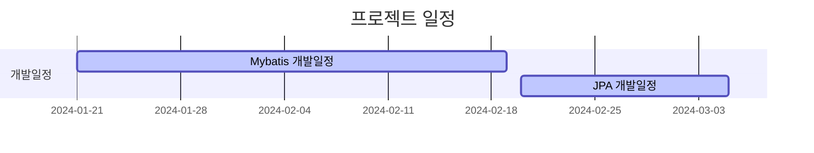

# item-browser

## 프로젝트 개요

`item-browser` 는 다양한 상품을 검색하고, 필터링할 수 있는 온라인 상품 쇼핑몰입니다.
해당 플랫폼은 사용자가 손쉽게 원하는 상품을 찾고, 상세 정보를 확인할 수 있도록 범용적인 설계가 되어 있습니다.
또한, 사용자가 원하는 상품을 장바구니에 담거나, 주문 및 결제할 수 있습니다.

## 개발 환경 및 사용기술

- IDE: IntelliJ IDEA
- Language: Java 11
- Framework: Spring Boot 2.7.1
- Build Tool: Gradle
- DB: MYSQL 5.7
- Test: JUnit5
- API 문서: Swagger3 + Spring RestDocs

---

# API 엔드포인트 목록

## 장바구니 관련 엔드포인트 (CartApiController)

### 장바구니 조회
- **GET** `/v1/api/cart/{userId}`
    - 특정 사용자의 장바구니 정보를 조회합니다.
    - `{userId}`는 사용자의 고유 식별자입니다.

### 장바구니에 상품 추가
- **POST** `/v1/api/cart`
    - 장바구니에 새로운 상품을 추가합니다.

### 장바구니 상품 수정
- **PUT** `/v1/api/cart`
    - 장바구니의 상품 수량을 수정합니다.

### 장바구니 상품 삭제
- **DELETE** `/v1/api/cart`
    - 장바구니에서 특정 상품을 삭제합니다.

## 회원 관련 엔드포인트 (MemberApiController)

### 회원가입
- **POST** `/v1/api/member/register`
    - 새로운 회원을 등록합니다.

## 주문 관련 엔드포인트 (OrderApiController)

### 주문 조회
- **GET** `/v1/api/orders/{orderId}`
    - 특정 주문의 상세 정보를 조회합니다.
    - `{orderId}`는 주문의 고유 식별자입니다.

### 주문 생성
- **POST** `/v1/api/orders`
    - 새로운 주문을 생성합니다.

### 사용자 주문 목록 조회
- **GET** `/v1/api/orders/users/{userNumber}`
    - 특정 사용자의 주문 목록을 조회합니다.
    - `{userNumber}`는 사용자의 고유 번호입니다.

### 주문 삭제
- **DELETE** `/v1/api/orders/{orderId}`
    - 특정 주문을 삭제합니다.
    - `{orderId}`는 주문의 고유 식별자입니다.

## 상품 관련 엔드포인트 (ProductApiController)

### 상품 추가
- **POST** `/v1/api/products`
    - 새로운 상품을 추가합니다.

### 상품 수정
- **PUT** `/v1/api/products/{productId}`
    - 기존 상품의 정보를 수정합니다.
    - `{productId}`는 상품의 고유 식별자입니다.

### 상품 삭제
- **DELETE** `/v1/api/products/{productId}`
    - 특정 상품을 삭제합니다.
    - `{productId}`는 상품의 고유 식별자입니다.

### 상품 상세 정보 조회
- **GET** `/v1/api/products/{productId}`
    - 특정 상품의 상세 정보를 조회합니다.
    - `{productId}`는 상품의 고유 식별자입니다.

## 로그인 관련 엔드포인트 (LoginApiController)

### 로그인
- **POST** `/login`
    - 사용자 로그인을 처리합니다.

### 토큰 갱신
- **PUT** `/refresh-token`
    - 사용자의 토큰을 갱신합니다.

---

## GANNT CHART

## TEAM NOTION

    [팀 노션 바로가기](https://iodized-bassoon-8e3.notion.site/5b24052881b34fd1ac8fbcf269ad3ba0?pvs=4)